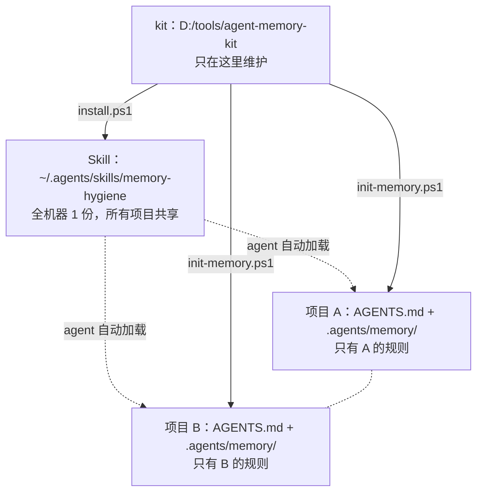
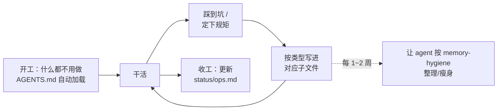

# 教程：从零跑通「项目记忆体系」

> 目标读者：第一次使用本 kit 的人。
> 读完你能：**① 在多个项目里各建一套互不干扰的记忆；② 知道每天怎么用；③ 遇到冲突知道怎么处理。**
>
> 配套阅读：`README.md`（为什么这么设计）、`skills/memory-hygiene/SKILL.md`（维护判据，主要给 agent 看）。
> 如果你只想要一页纸的命令，直接跳到最后的「命令速查卡」。

---

## 0. 先分清三个东西（3 分钟）

新手最容易混的就是这三个，混了就必然出「会不会冲突」的焦虑：

| 名字             | 是什么                           | 存在哪                                                    | 有几份                        |
| ---------------- | -------------------------------- | --------------------------------------------------------- | ----------------------------- |
| **kit**          | 这个仓库（脚本 + 模板 + Skill）  | 你 clone / 已在开发的那份，如 `D:\tools\agent-memory-kit` | 全机器**只维护 1 份**         |
| **记忆**（骨架） | 某个项目的规则文件               | `<项目>/AGENTS.md` + `<项目>/.agents/memory/`             | **每个项目 1 份，互相看不见** |
| **Skill**        | 教 agent「怎么维护记忆」的说明书 | `%USERPROFILE%\.agents\skills\memory-hygiene\`            | **全机器 1 份，所有项目共享** |



**一句话记住：记忆按项目分，Skill 全机器共享。**

关键推论：

- 两个项目之间**永远不会互相污染**——它们各自读自己的 `AGENTS.md`。
- 唯一会被多方共用的是 Skill 目录，所以那边的规则要清楚（见 3.2）。
- kit 只需要一份。在项目里再复制一份 kit 副本，是在给自己制造 3.2 的麻烦。

---

## 1. 安装（一次性，约 5 分钟）

### 1.1 把 kit 放到一个固定位置

仓库地址：`https://github.com/luoxiwhyye/agent-memory-kit.git`

```powershell
# 路径随你；下文命令里的 D:\tools\agent-memory-kit 记得换成你自己的
git clone https://github.com/luoxiwhyye/agent-memory-kit.git D:\tools\agent-memory-kit
```

> **已经有 kit 副本就不要 clone 第二份。** 两种常见情况：
>
> - 你就在这个 kit 仓库里开发它 —— 那个工作副本**本身就是 kit**，直接用；
> - 之前已经 clone 过 —— 用原来那份，不要换位置。
>
> 多份副本会争抢同一个 Skill 目录（详见 3.2），是自寻麻烦。

装好后 kit 里长这样（`memory-template/` 是**骨架本体**）：

```
agent-memory-kit/
├── install.ps1                            # 装 Skill（全机器共享）
├── init-memory.ps1                        # 搭记忆骨架（每个项目跑一次）
├── memory-template/                       # ← 骨架本体，结构与目标布局逐层对应
│   ├── AGENTS.md
│   └── .agents/memory/{knowledge,status}/
└── skills/memory-hygiene/SKILL.md
```

### 1.2 安装 Skill（只在 kit 目录里做）

```powershell
cd D:\tools\agent-memory-kit
pwsh -File .\install.ps1 -List    # 先预览要动哪些文件
pwsh -File .\install.ps1          # 真正安装
```

装完会提示你**重载窗口**（`Developer: Reload Window`）—— 这一步别省，否则 agent 不知道有新 Skill。

### 1.3 验证 Skill 装上了

看这两个文件在不在：

```powershell
Get-ChildItem "$env:USERPROFILE\.agents\skills\memory-hygiene"
# 应有：SKILL.md 和 .installed-by-agent-memory-kit（安装标记）
```

再新开一个会话，问 agent：「你加载到了哪些 skills？」。
**这一步值得做** —— 如果 agent 答不出来，后面「让 agent 帮你整理记忆」就都不会生效。

---

## 2. 给第一个项目搭骨架

### 2.0 顺序：先 clone 项目，再搭骨架（不要反过来）

骨架**必须搭在已经 clone 好的项目里**。如果你先把骨架搭在一个空目录、再想把项目 clone 进去，
git 会直接拒绝：

```
fatal: destination path 'X' already exists and is not an empty directory.
```

正确顺序：

1. clone kit 到固定位置（只做一次，什么时候都行）
2. clone 你的项目到工作目录
3. 进项目，跑 `init-memory.ps1`

> kit 和你的项目**互不依赖**，放哪都行，不需要相邻、也不需要同一个工作区。
> 但 kit 别删 —— 以后升级 Skill、补骨架文件都还要用它。
> 只有一个例外：**全新项目还没有 git 仓库**时，可以先 `mkdir` + `git init` 再搭骨架，都一样。

### 2.1 执行

```powershell
cd D:\code\ProjectA

# 先预览（强烈建议；它会告诉你哪些文件已存在、.gitignore 会加什么）
pwsh -File D:\tools\agent-memory-kit\init-memory.ps1 -Project ProjectA -List

# 确认无误再执行
pwsh -File D:\tools\agent-memory-kit\init-memory.ps1 -Project ProjectA
```

生成的骨架：

```
ProjectA/
├── AGENTS.md                    ← 入口，agent 每次对话自动读
└── .agents/memory/
    ├── knowledge/               ← 项目知识（长期有效）
    │   ├── conventions.md       ← 约定：命名 / 唯一实现 / 禁止项
    │   ├── backend.md           ← 接口 / 数据 / 鉴权契约（用不到就删）
    │   ├── deploy.md            ← 部署 / 回滚 / 恢复（用不到就删）
    │   ├── pitfalls.md          ← 踩过的坑（现象 → 根因 → 对策）
    │   ├── verify.md            ← 怎么验证（按改动面选命令）
    │   └── log.md               ← 历史流水（只追溯时读）
    └── status/
        └── ops.md               ← 此刻做到哪了（会过期，闭环后当天删）
```

搭完之后要做的四件事：

1. **填 `AGENTS.md` 的两节**：「1. 结构与启动」和「2. 高频铁律」。其余留空 —— 它会在使用中长出来。
2. **删掉用不到的子文件**。没有服务端就删 `backend.md`，不上线就删 `deploy.md`；
   删文件的同时**把 `AGENTS.md` 索引表里那一行也删掉**（否则入口指向不存在的文件）。
3. **重载窗口**，然后问 agent「你加载到了哪些规则文件」确认生效。
4. **决定 `.gitignore` 的改动要不要提交** —— 脚本不会替你 `git add`。

### 关于 `.gitignore`：脚本加了什么

```gitignore
/AGENTS.md              # 入口文件
.agents/memory/         # 记忆目录（注意：精确到 memory/）
.clineignore            # Cline 的本机忽略规则
```

为什么默认不入库：这些是**本机 AI 约定**，写着你自己的路径、环境、踩坑记录，
不适合出现在给别人 clone 的仓库里。而两个 agent 读它们走的是**文件读取，不受 gitignore 影响**，
所以忽略不影响功能。

> 注意 `.agents/memory/` 是**精确**的：`<项目>/.agents/skills/`（仓库级 Skill）
> **不会被忽略**，可以正常入库与团队共享。

**如果你不想让别人在项目里看到那三行**，更好的做法是把它们写进 `.git/info/exclude`
（本机专用、永不入库）：

```powershell
Add-Content .git\info\exclude "`n/AGENTS.md`n.agents/memory/`n.clineignore"
# 然后把 init-memory.ps1 之前加进 .gitignore 的那几行手工删掉
```

---

## 3. 再给第二个项目搭骨架

```powershell
cd D:\code\ProjectB
pwsh -File D:\tools\agent-memory-kit\init-memory.ps1 -Project ProjectB
```

**结论：不会冲突。** 原因是两个脚本的写入范围完全不同：

| 脚本              | 写到哪                                                                      | 跨项目共享 | 冲突策略                           |
| ----------------- | --------------------------------------------------------------------------- | ---------- | ---------------------------------- |
| `init-memory.ps1` | **只在目标项目内部**：`AGENTS.md`、`.agents/memory/`、该项目的 `.gitignore` | 否         | **绝不覆盖**：已存在就跳过         |
| `install.ps1`     | `%USERPROFILE%\.agents\skills\`                                             | **是**     | **按来源保护**：不是本仓库装的不动 |

所以只要你遵守下面三条，多少个项目都不会互相影响：

### 三条经验规则

1. **只在 kit 目录里跑 `install.ps1`。** 项目里永远只跑 `init-memory.ps1`
   （它根本不碰运行时目录）。
2. **只在 kit 的 `skills/` 增删或修改 Skill 后**，才需要重跑 `install.ps1`。
   平时改记忆、改项目代码，都不需要重装 Skill。
3. **不要在项目里再放一份 kit 副本。** 多份副本会让「谁装 Skill」变得不确定
   （下一节说明现在有怎样的保护）。

### 3.1 怎么确认两个项目真的没互相影响

```powershell
# 在项目 A 里再跑一次 -List：应该全是「= 已存在」
pwsh -File D:\tools\agent-memory-kit\init-memory.ps1 -Path D:\code\ProjectA -List
```

看到 `= AGENTS.md`、`= knowledge\...` 就说明幂等生效、没有重复写入。

### 3.2 如果你确实在多个项目里放了 kit 副本

运行时目录 `~/.agents/skills/` 是**全机器共享**的，两份副本会争抢同一个位置。
现在的规则是：

- 每个已安装的 Skill 目录里有一个标记文件，记录**它是谁装的**（源的绝对路径）。
- 第二个副本执行 `install.ps1` 时，发现运行时那份是**别的副本装的** →
  **跳过不动**，并提示你可以用 `-Force` 抢过来。
- 想让某个固定副本成为唯一来源：在它那里跑 `pwsh -File install.ps1 -Force`。

所以「谁装的」这件事是**可查、可接管**的，不会再出现静默覆盖：

```powershell
Get-Content "$env:USERPROFILE\.agents\skills\memory-hygiene\.installed-by-agent-memory-kit"
# 源：D:\tools\agent-memory-kit\skills\memory-hygiene   ← 这就是当前生效的那份
```

---

## 4. 日常怎么用（这才是真正的价值）

脚手架搭好后，**日常工作主要是「记录」和「读取」两件事**。流程长这样：



### 4.1 开工时不用做任何事

`AGENTS.md` 会被 agent **每次对话自动加载**，你不用提醒它去读。
细则（`conventions.md` 等）由 agent 按 `AGENTS.md` 里的「什么时候读」按需读取 ——
所以入口文件必须精简（建议 ≤100 行）。

### 4.2 记东西的时候往哪写（最常用的一张表）

| 你刚经历了什么                     | 写到哪                     | 格式要求                     |
| ---------------------------------- | -------------------------- | ---------------------------- |
| 踩了个怪现象，排查了半小时         | `knowledge/pitfalls.md`    | 现象 → 根因 → 对策，一行一条 |
| 定下一条「以后都得遵守」的规矩     | `knowledge/conventions.md` | 只写当前规则，不写变更史     |
| 搞懂了某处历史设计「为什么这么做」 | `knowledge/log.md`         | 按主题分组，不是按时间       |
| 发现一个好用的验证姿势             | `knowledge/verify.md`      | 适用场景 → 做法 → 判据       |
| 搞清了接口/数据/鉴权的契约         | `knowledge/backend.md`     | 契约与边界，不写实现细节     |
| 摸清了部署/回滚/恢复的门道         | `knowledge/deploy.md`      | 怎么安全地做，不写流水账     |
| 一个任务做完 / 卡住了              | `status/ops.md`            | 只写此刻状态，闭环后当天删   |

### 4.3 什么时候**别**写（省得记忆腐烂）

- **代码里一眼能看出来的** → 不写。
- **`git log` 里已经有的** → 不写，最多留一行指针。
- **「这次我是这么做的」（一次性的过程）** → 不写。
- **推翻过的旧结论** → 删掉或标「已作废 + 原因」，**不要只删**（否则下次还会有人照着做）。

判断标准只有一条：**「下一次对话没有它，我就会做错事」** —— 是就写，不是就不写。

### 4.4 定期瘦身

每 1~2 周，或者觉得某个文件读起来太累时，直接对 agent 说：

```
按 memory-hygiene 检查一下 .agents/memory，把重复和过期的整理掉
```

它会按「删 / 压 / 并 / 升 / 迁」给每条定去向。**整理前先备份**（让它把文件复制一份带日期的）。

### 4.5 让它自己长大（最重要的一条）

不要一开始就想着「把规则写全」—— 那只会写出一堆没人看的大文件。
正确姿势是：**干活时顺手记，用着用着自然分层**。

```
流水（log.md）里的结论
      ↓ 当它变成「以后每次都要遵守」
规则（conventions / pitfalls / ...）   ← 搬家，不是复制；原地留一行指针
      ↓ 当它变成「每轮都必须知道」
入口（AGENTS.md）                      ← 只留一行，详情仍在子文件
```

---

## 5. 常见问题（FAQ）

### Q1 我的项目已经有一个 `AGENTS.md` 了，会被覆盖吗？

**不会被覆盖。** 脚本会把它标成 `!` 并在最后单独提示：

```
⚠️ 1 个文件已存在且与模板不同 —— 已跳过，未覆盖：
     AGENTS.md
```

两条处理路径：

- **推荐**：手工把骨架的「记忆分两层」表和「写条目前的三问」两节**并进你现有的 `AGENTS.md`**，
  再把 `knowledge/` 子文件建起来。这样保留了你原有的规则，又拿到了分层结构。
- 只在这些文件**确实是骨架生成的、可以安全重置**时，才用 `-Force`
  （它会先把原文件备份成 `AGENTS.md.bak-<时间戳>`）。

> 如果那个 `AGENTS.md` 是团队在用、要入库的，**一定选手工合并**，别用 `-Force`。

### Q2 我在两个项目里都跑了 `install.ps1`，会怎样？

现在**有保护**：第二个副本会发现运行时那份 Skill 是「另一份副本装的」，跳过并提示，
不会静默覆盖。用 `pwsh -File install.ps1 -Force` 可以让当前副本接管。

不过更推荐的做法是**只在固定位置维护一份 kit**，其它项目只跑 `init-memory.ps1`。

### Q3 `-Prune` 会删掉我别的 Skill 吗？

**不会。** 判断依据是标记文件里记录的**安装来源**，只有「来源 == 本仓库」的才会被删。
其它情况全部跳过并打印原因：

```
跳过（不是本脚本安装的（无标记文件））：find-skills
跳过（已由另一份 kit 副本安装（D:\another\clone\...））：some-skill
将移除已废弃的 Skill：old-skill-from-this-repo
```

`-Prune` 只在「你在 kit 的 `skills/` 里删掉了一个 Skill、想把运行时副本也清掉」时才需要。

### Q4 我想让记忆入库，和团队共享，怎么办？

把 `.gitignore` 里的忽略规则删掉即可。但**先做一件事**：扫一遍记忆里有没有本机特有的东西
（绝对路径、`127.0.0.1:xxxx` 端口、账号、内网地址）。

更精细的玩法是**分层入库**：

```gitignore
# 只排除「个人状态」，让 knowledge/ 进库
.agents/memory/status/
```

这样长期知识（约定、坑、验证手段）团队共享，而「我此刻做到哪了」仍是你自己的。

### Q5 仓库级 Skill（`<项目>/.agents/skills/`）为什么进不了库？

这是**旧版本的坑**：早期版本往 `.gitignore` 写的是裸 `.agents`，会把整个目录连同
`.agents/skills/` 一起忽略掉，团队 clone 后就拿不到你的仓库级 Skill。

现在脚本会写精确规则，并且**遇到过宽的老规则会警告**：

```
⚠️ .gitignore 里有过宽的规则：.agents
   它会把整个 .agents/ 忽略掉，仓库级 Skill（.agents/skills/）就进不了库。
   建议把该行手工替换为：.agents/memory/
```

按提示手工改掉那一行即可（脚本不自动改 `.gitignore`，那是你的文件）。

> 如果 `AGENTS.md` 已经被 git 跟踪过，之后再加进 `.gitignore` **不会**让它失效。
> 需要 `git rm --cached AGENTS.md` 才会真正停止跟踪。

### Q6 multi-root 工作区同时开了两个项目，规则会串吗？

**会。** 两个项目的 `AGENTS.md` 可能都会被加载，agent 就分不清哪条规则属于哪个项目了。

处理方式：

- 一次只在一个项目窗口里干活（推荐，最省事）；
- 或把不相关的项目从工作区移除（只保留当前在做的那个）；
- 或在各自 `AGENTS.md` 顶部写明「本文件只适用于 `<项目名>`，同工作区的其它项目请忽略」。

### Q7 Cline 读不到规则

按顺序查：

1. 是不是没重载窗口？
2. `.clineignore` 是否把 `AGENTS.md` 排除了？（脚本不创建这个文件，可能是你之前写的）
3. 文件是不是在**项目根目录**？（不是工作区根的上级）
4. 新开会话直接问：「你加载到了哪些规则文件？」

### Q8 记忆文件越长越大、内容重复怎么办？

让 agent 按 `memory-hygiene` 整理一遍。它有一张「五种腐烂方式」自查表：

| 症状                    | 病因                   | 处理                           |
| ----------------------- | ---------------------- | ------------------------------ |
| 文件长到几百 KB，没人读 | 把「过程」当「知识」写 | 砍掉排查过程，只留结论与根因   |
| 同一件事写了 3~7 遍     | 每轮追加、不回头合并   | 合并成一处，写「最终态」       |
| 记录了已被推翻的做法    | 只追加不删除           | 删或标作废 + 说明原因          |
| 自相矛盾                | 局部更新、没通读       | 以最新/代码为准，统一          |
| 入口文件越写越长        | 把子文件内容抄了上来   | 只留索引与铁律，详情移回子文件 |

### Q9 怎么卸载 / 迁移？

| 想做什么       | 做法                                                                                     |
| -------------- | ---------------------------------------------------------------------------------------- |
| 从某项目移除   | 删 `AGENTS.md`、`.agents/memory/`，再从 `.gitignore`（或 `.git/info/exclude`）删掉那几行 |
| 卸载全局 Skill | 删 `%USERPROFILE%\.agents\skills\memory-hygiene\` 整个目录                               |
| 换机器         | 重新 clone 一份 kit、跑 `install.ps1`；各项目的记忆跟着项目走，不用搬                    |
| 彻底不用了     | 上面都做一遍即可；kit 里没有任何服务或数据库依赖                                         |

### Q10 别人 clone 我的项目会看到什么？

- **看不到**记忆内容（已被忽略）。
- 看到的是正常项目，唯一的痕迹是 `.gitignore` 里可能多了一个「本机 AI 约定」块。
- 如果连这个都不想留：把那几行移到 `.git/info/exclude`（本机专用、不入库，见 2 节末尾）。

### Q11 我以前生成的骨架在项目根目录（`knowledge/`、`status/`），怎么迁移？

早期版本的 `init-memory.ps1` 会把骨架写到项目根，而不是 `.agents/memory/`。
判断方法：项目根下是不是直接有 `knowledge/` 和 `status/` 两个目录。

迁移就是一次目录移动（**新脚本不会替你搬** —— 它对已存在的文件一律不动）：

```powershell
mkdir .agents\memory -Force
Move-Item knowledge .agents\memory\knowledge
Move-Item status   .agents\memory\status
git check-ignore -v .agents/memory/status/ops.md   # 确认新位置被忽略
```

移动完把 `AGENTS.md` 里的路径核对一遍（它本来写的就是 `.agents/memory/...`，所以应该正好对上）。
如果旧的 `knowledge/`、`status/` 已经被 git 跟踪，还要 `git rm -r --cached knowledge status` 停掉跟踪。

---

## 6. 排错速查

| 现象                                                            | 原因                                                        | 处理                                                            |
| --------------------------------------------------------------- | ----------------------------------------------------------- | --------------------------------------------------------------- |
| `git clone` 报 `destination path ... is not an empty directory` | 先在空目录里搭了骨架，再想 clone 进同一目录                 | 删掉该目录重新 clone；本书 2.0 节有正确顺序                     |
| 脚本报 `模板布局异常：骨架必须与目标布局逐层对应`               | `memory-template/` 被改扁了，或它的 `.agents/` 没提交进仓库 | 恢复 `.agents/memory/` 结构；脚本宁可不跑，也不把记忆写到项目根 |
| 项目根下出现了 `knowledge/`、`status/`                          | 用的是早期版本（骨架曾写到项目根）                          | 按 FAQ Q11 把两个目录移进 `.agents/memory/`                     |
| 脚本报告 `无新增（N 个文件已存在，未覆盖）`                     | 之前跑过（正常幂等），或项目已有同名文件                    | 看是否有 `!` 标记的冲突项；没有就是已经就绪                     |
| `! AGENTS.md` 出现在列表里                                      | 目标已有且内容与模板不同                                    | 手工合并（推荐）或 `-Force`（会备份）                           |
| `! some-skill —— 跳过：已由另一份 kit 副本安装`                 | 运行时那份不是本仓库装的                                    | 用 `-Force` 接管，或干脆只保留一份 kit                          |
| `⚠️ .gitignore 里有过宽的规则：.agents`                         | 旧版本或手写的规则太宽                                      | 手工改成 `.agents/memory/`                                      |
| agent 说不知道有什么规则                                        | 没重载窗口，或文件位置不对                                  | 重载窗口；确认 `AGENTS.md` 在项目根                             |
| agent 答不出有什么 skill                                        | Skill 没装到运行时目录                                      | 在 kit 目录跑 `install.ps1` 后重载窗口                          |
| 记忆里写出了互相矛盾的两条                                      | 局部更新、没通读                                            | 让 agent 按 `memory-hygiene` 统一，以代码为准                   |
| `-Prune` 说跳过某个 Skill                                       | 那份不是本仓库装的（保护生效）                              | 正常行为；确实要删就手工删                                      |

---

## 7. 命令速查卡

```powershell
# ── 只做一次的（kit 目录）──────────────────────────
pwsh -File .\install.ps1 -List          # 预览 Skill 部署
pwsh -File .\install.ps1                # 部署 Skill 到 ~/.agents/skills/
pwsh -File .\install.ps1 -Force         # 让本副本接管运行时 Skill

# ── 每个项目一次（项目目录）────────────────────────
pwsh -File <kit>\init-memory.ps1 -Project <项目名> -List   # 预览
pwsh -File <kit>\init-memory.ps1 -Project <项目名>         # 搭骨架
pwsh -File <kit>\init-memory.ps1 -Force                    # 重置（先备份为 *.bak-<时间戳>）

# ── 想改动 kit 本身时 ──────────────────────────────
# 改了 skills/ 里的内容 → 重跑 install.ps1 并重载窗口

# ── 日常（对 agent 说就行）─────────────────────────
# 「按 memory-hygiene 检查一下 .agents/memory」
# 「把这次踩的坑记进 pitfalls.md」
# 「更新 ops.md 的进度」
```

**两个脚本各自只做一件事：**

- `install.ps1` = 管**全机器共享的 Skill**（幂等、按来源保护、`-Prune` 只清自己装的）
- `init-memory.ps1` = 管**某个项目的记忆骨架**（幂等、绝不覆盖、冲突单独提示）

记住这一点，多项目就不会乱。
